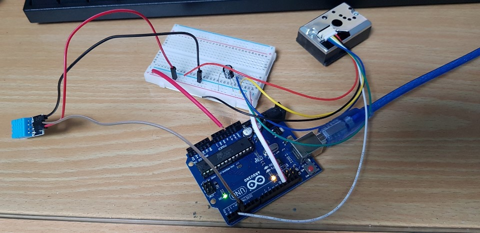
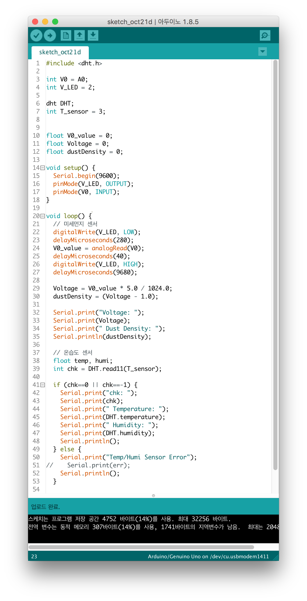
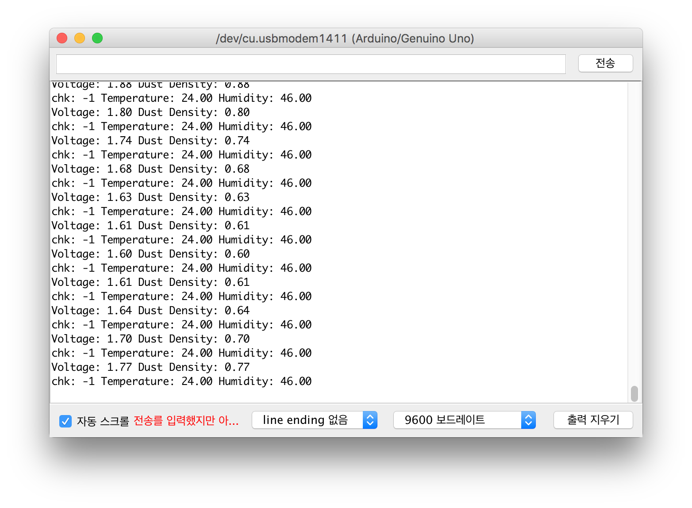
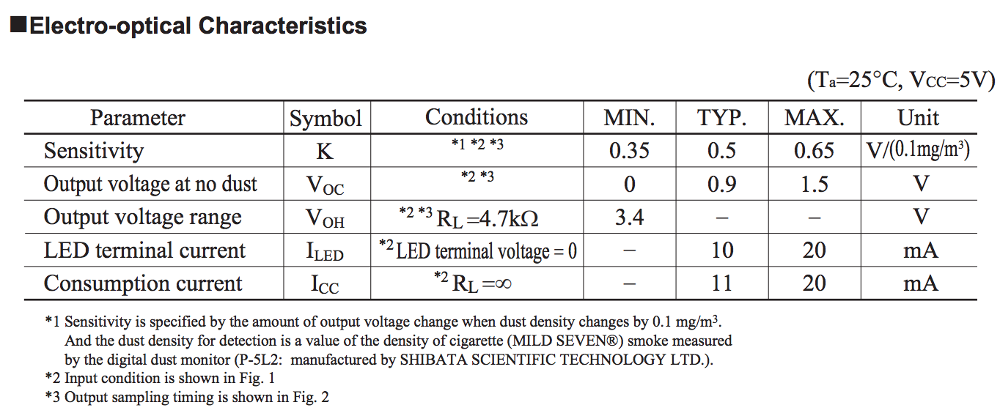

# Putting Sensors to Arduino

## Setting Arduino



We've started this project from connecting Arduino to GP2Y1010AU0F, fine dust detector, and DHT11, temperature/humidity sensor. Here's list of materials used:

| Materials | Description |
| :--- | :--- |
| Arduino Uno | Main processor |
| BHT11 | Sense temperature and humidity |
| GP2Y1010AU0F | Fine dust sensor |
| Breadboard |  |
| Jumper Cables |  |

See [tutorials of GP2Y1010AU0F](https://m.blog.naver.com/PostView.nhn?blogId=darknisia&logNo=221222455928&proxyReferer=https%3A%2F%2Fwww.google.co.kr%2F) and connect GP2Y1010AU0F like:


See [tutorials of BHT11](http://www.circuitbasics.com/how-to-set-up-the-dht11-humidity-sensor-on-an-arduino/) and connect BHT11 like:



To use dust sensor together, use 5V and GND node on breadboard.


Open Arduino Software and type:

```c
#include <dht.h>

// Pin GP2Y1010AU0F
int V0 = A0;
int V_LED = 2;

dht DHT;
// Pin DHT11
int T_sensor = 7;


float V0_value = 0;
float Voltage = 0;
float dustDensity = 0;

void setup() {
  Serial.begin(9600);
  pinMode(V_LED, OUTPUT);
  pinMode(V0, INPUT);
}

void loop() {
  // 미세먼지 센서
  digitalWrite(V_LED, LOW);
  delayMicroseconds(280);
  V0_value = analogRead(V0);
  delayMicroseconds(40);
  digitalWrite(V_LED, HIGH);
  delayMicroseconds(9680);

  Voltage = V0_value * 5.0 / 1024.0;
  dustDensity = (Voltage - 1.0);

  Serial.print("Voltage: ");
  Serial.print(Voltage);
  Serial.print(" Dust Density: ");
  Serial.println(dustDensity);

  // 온습도 센서
  float temp, humi;
  int chk = DHT.read11(T_sensor);

  if (chk==0 || chk==-1) {
    Serial.print("chk: ");
    Serial.print(chk);
    Serial.print(" Temperature: ");
    Serial.print(DHT.temperature);
    Serial.print(" Humidity: ");
    Serial.print(DHT.humidity);
    Serial.println();
  } else {
    Serial.print("Temp/Humi Sensor Error");
//    Serial.print(err);
    Serial.println();
  }
}
```



Here's the result on serial monitor:





According to GP2Y1010AU0F datasheet,  Output voltage at no dust is between 0 and 1.5 Volts. To get raw voltage value,  multiply the raw value by 5.0 and divide by 1024.0, and subtract the value between 0 - 1.5. The value may different to sensors. To measure the value, make no-dust environment by blocking the sensing hole and taking time to dust sink. Putting the sensor nearby air cleaner is also suggested. 

```c
  Voltage = V0_value * 5.0 / 1024.0;
  dustDensity = (Voltage - 1.0);
```


